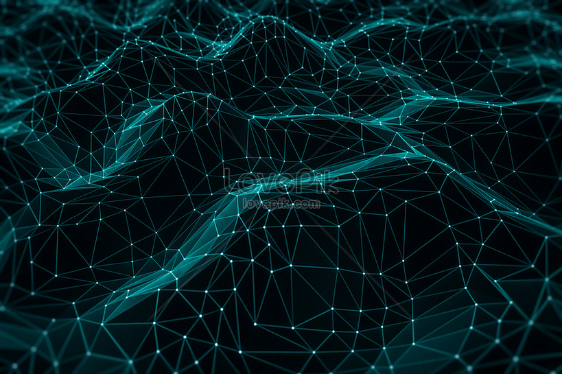

import Triangles1 from "./triangles1.js"
import Point from "./point.js"
import Points from "./points.js"
import PointsMesh from "./PointsMesh.js"

## Abstract

I saw a cool website background once and I want to try and recreate it.

## Inspiration

I could have sworn that I saw this background on the datadog homepage. It's no longer there and I can't find it in the waybackmachine. Oh well.

It kind of looked like the following image ([source](https://lovepik.com/image-401531739/tech-blue-low-polygon-mesh-background.html)), but each point was undulating up and down.

## Building

### Triangle

I LOVE [react-three-fiber](https://github.com/pmndrs/react-three-fiber) for projects like this. It gives you all of the 3D power of [three.js](https://threejs.org/) with the ease of use and performance benefits of [react](https://reactjs.org/).

Step 1 was to create a triangle. I also added some controls (pan, rotate, zoom) and grid helper.

I also added a click handler to show off the power of R3F (click on the triangle).

<Triangles1 />

### Animating a single point

<Point />

This point follows a sinusoid. You can adjust the amplitude and frequency of the point using the sliders.

### Animating few points

<Points />

Nice, now we're getting somewhere.

### Points Mesh

<PointsMesh />

Looking nice and wavy now.

I think that's where I'm going to leave it for now. I'd highly recommend checking out R3F!

## References

- [Source Code](https://github.com/michals2/portfolio/blob/master/src/posts/mesh-background/index.mdx)
- [react-three-fiber](https://github.com/pmndrs/react-three-fiber)