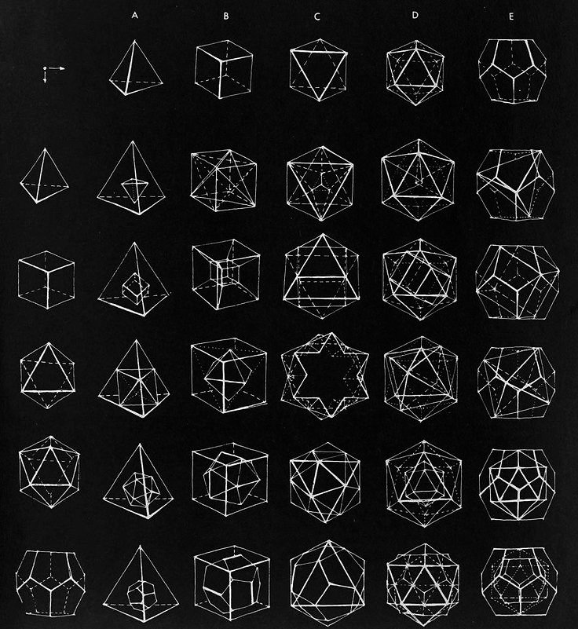

import PlatonicSolids from "./PlatonicSolids.js"

## Abstract

I found a cool image on [Twitter](https://twitter.com/archillect/status/1146096264599277569) and I wanted to play around with a 3D library called [react-three-fiber](https://github.com/pmndrs/react-three-fiber).

## Image

## Model

<PlatonicSolids />

## Conclusion

React three fiber is a really cool library! This is the first time I've seen a library use React pureley as a renderer over another library and it's really fun to use!
